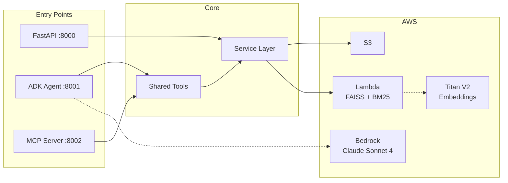

# aws-rag-bot-v2

[](https://deepwiki.com/ayrtondenner/aws-rag-bot-v2)

RAG (Retrieval-Augmented Generation) backend built with **FastAPI**, **AWS** (S3, Bedrock, Lambda, FAISS+BM25), **Google ADK** agents, and an **MCP server**. Ingests documents, chunks and embeds them with Amazon Titan V2, and serves hybrid search (BM25 + vector) queries through a REST API, a conversational agent layer, and an MCP tool server.

The project enables users to ask natural-language questions about **AWS SageMaker documentation** and get accurate answers backed by source documents - instead of searching through large documentation sets manually.

> **Detailed documentation lives in the [GitHub Wiki](https://github.com/ayrtondenner/aws-rag-bot-v2/wiki).** Each section below links to its corresponding wiki page for in-depth explanations, code examples, and setup instructions.

## Architecture

The project exposes three entry points into a shared service layer backed by AWS:



> [Detailed architecture, project structure, and startup process &rarr; Wiki: Architecture](https://github.com/ayrtondenner/aws-rag-bot-v2/wiki/Architecture)

## AWS Technologies

| Service | Purpose |
|---------|---------|
| **Amazon S3** | Document storage + search index artifacts (`aioboto3`, auto-provisioned at startup) |
| **Amazon Bedrock — Claude Sonnet 4** | LLM for the Google ADK agent (via LiteLLM) |
| **Amazon Bedrock — Titan V2 Embeddings** | 1024-dim embeddings (LangChain `BedrockEmbeddings` + Lambda direct calls) |
| **AWS Lambda** | Hybrid search engine — FAISS vector + BM25 lexical (`boto3` invoke) |
| **IAM** | Service roles for Lambda, Bedrock, and S3 access |

> [Full AWS details and environment variables &rarr; Wiki: AWS Technologies](https://github.com/ayrtondenner/aws-rag-bot-v2/wiki/AWS-Technologies)

## RAG Pipeline

Hybrid search combining BM25 text matching and FAISS vector search over 500-character chunks (50-char overlap) embedded with Titan V2. Documents are ingested from local `sagemaker-docs/` files (336 markdown docs) or via API. The Lambda function performs min-max normalization and weighted fusion (0.3 BM25, 0.7 vector).

> [Full RAG documentation, search index architecture, Terraform infrastructure &rarr; Wiki: RAG and Search](https://github.com/ayrtondenner/aws-rag-bot-v2/wiki/RAG-and-OpenSearch)
>
> **Infrastructure setup**: Use Terraform (`infra/`) to provision S3, IAM, and Lambda. Then run `scripts/build_search_index.py` to build and upload the index.

## Google ADK Agent

Root agent delegates to 3 sub-agents (S3, Document, Search), each with domain-specific tools defined in `shared/`. Powered by AWS Bedrock Claude Sonnet 4 via LiteLLM. Run with `adk web --port 8001`.

Through the agent, users can:
- **List available documents** in local storage or an S3 bucket
- **Check if a specific document exists** locally, in S3, or in the search index
- **Fetch content** from a specific document (local file or S3 object)
- **Search indexed documents** using hybrid search (BM25 + vector)
- **Check S3 bucket status** (existence and accessibility)
- **View search index statistics** (document count, index status)

> [Agent details, sub-agents, tools, example conversations &rarr; Wiki: Google ADK Agent](https://github.com/ayrtondenner/aws-rag-bot-v2/wiki/Google-ADK-Agent)

## MCP Server

FastMCP server exposing 10 tools via streamable-http on port 8002. Uses the same shared tool functions as the agent. Run with `python -m mcp_server.main`.

> [MCP tools, configuration, running instructions &rarr; Wiki: MCP Server](https://github.com/ayrtondenner/aws-rag-bot-v2/wiki/MCP-Server)

## API & Swagger

FastAPI serves three route groups: `/search`, `/s3`, `/document`. Interactive Swagger documentation is available at `/docs` when the server is running.

> [Full route tables and error handling &rarr; Wiki: API Routes](https://github.com/ayrtondenner/aws-rag-bot-v2/wiki/API-Routes)

## AI Assistant Instructions

This project uses git-tracked instruction files to guide AI coding assistants ([GitHub Copilot](https://aka.ms/vscode-ghcp-custom-instructions) and Claude Code) during development. The instruction files are automatically picked up by VS Code:

| File | Assistant | Scope |
|------|-----------|-------|
| `.github/copilot-instructions.md` | GitHub Copilot | General — project overview, tech stack, coding conventions |
| `.github/copilot-code-instructions.md` | GitHub Copilot | Code generation — step-by-step implementation workflow |
| `CLAUDE.md` | Claude Code | Entry point — points to the Copilot files as the single source of truth |

## Technologies

| Technology | Role |
|------------|------|
| **FastAPI** | HTTP API framework |
| **Pydantic v2** | Request/response validation |
| **LangChain** | Text splitting (`RecursiveCharacterTextSplitter`) + Bedrock embeddings |
| **Google ADK** | Agent framework (root + sub-agent delegation) |
| **FastMCP** | MCP server |
| **LiteLLM** | LLM routing (Bedrock Claude Sonnet 4) |
| **aioboto3** | Async AWS S3 SDK |
| **boto3** | AWS SDK (Lambda invoke, S3 operations) |
| **faiss-cpu** | FAISS vector similarity search |
| **rank-bm25** | BM25Okapi lexical search |
| **Terraform** | Infrastructure as code (Lambda, S3, IAM) |
| **Pytest** | Testing framework |
| **Ruff** | Linting |
| **Conda** | Environment management (`environment.yml`) |

## Installation

Clone with submodules and create the Conda environment:

```bash
git clone --recurse-submodules https://github.com/ayrtondenner/aws-rag-bot-v2.git
conda env create -f environment.yml
conda activate aws-rag-bot
```

> [Full installation instructions, environment variables, infrastructure setup &rarr; Wiki: Installation](https://github.com/ayrtondenner/aws-rag-bot-v2/wiki/Installation)

## Testing

```bash
pytest
```

Tests use fake/stub client patterns for fast, isolated unit testing without calling real AWS services.

> [Test structure, patterns, commands &rarr; Wiki: Testing](https://github.com/ayrtondenner/aws-rag-bot-v2/wiki/Testing)

## Experiments

Jupyter notebooks in `experiments/` for evaluating search strategies:
- **Search Type Comparison** — hybrid vs text vs vector across 9 query categories
- **Reranking Strategies** — no reranking vs RRF vs cross-encoder vs LLM-based reranking

> [Experiment details, strategies, results &rarr; Wiki: Experiments](https://github.com/ayrtondenner/aws-rag-bot-v2/wiki/Experiments)

## Startup Process

On startup, FastAPI's lifespan handler initialises logging, creates a shared `aiohttp` session, provisions the S3 bucket if absent (idempotent), and sets up the search index (checks if Lambda and FAISS/BM25 artifacts exist, creates them if missing, and bulk-indexes all local `sagemaker-docs/` files — idempotent, already-indexed documents are skipped). If search setup fails, the app still starts; documents can be indexed later via the `/search/index-local-docs` endpoint.

> [Detailed startup flow &rarr; Wiki: Architecture — Startup Process](https://github.com/ayrtondenner/aws-rag-bot-v2/wiki/Architecture#startup-process)
